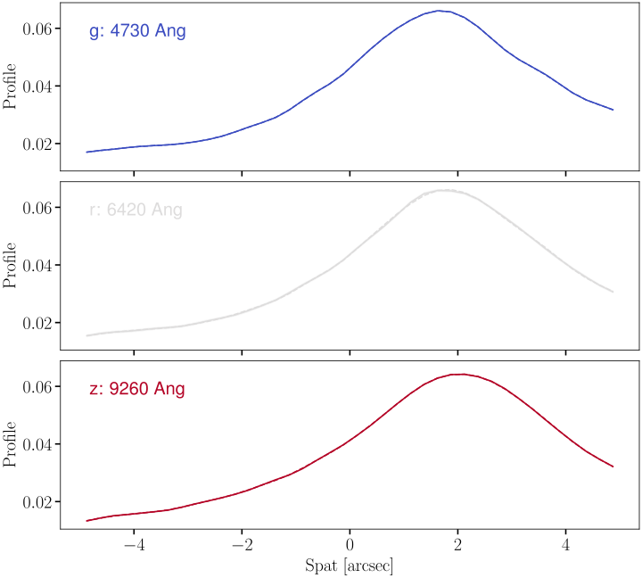
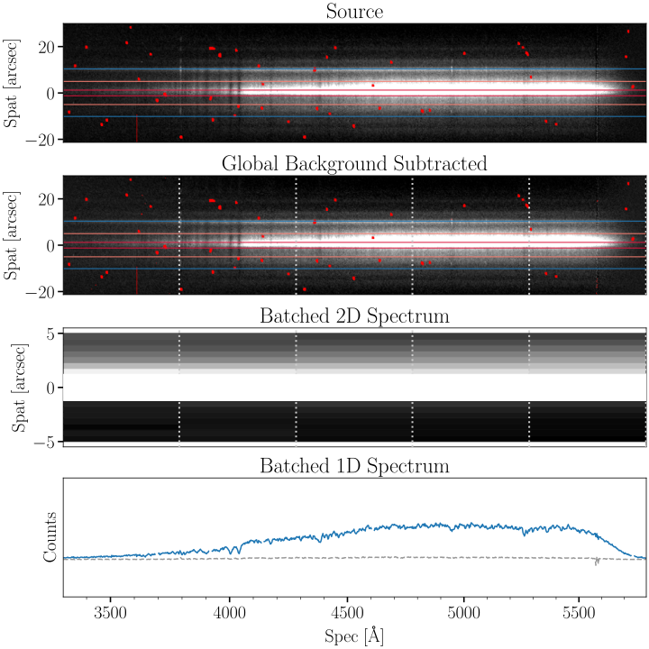
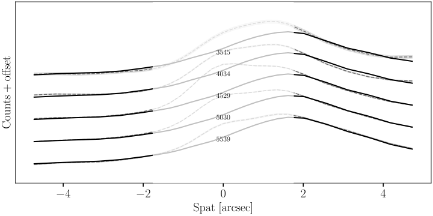
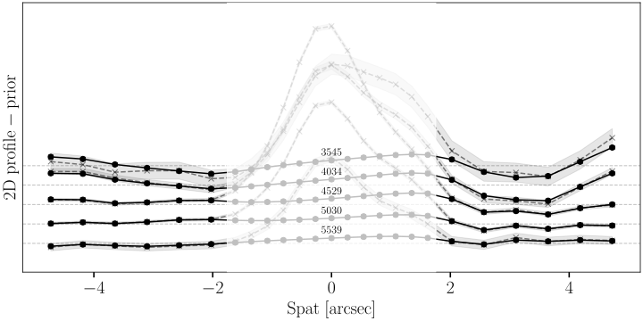
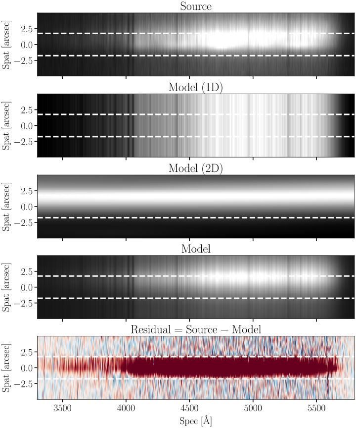
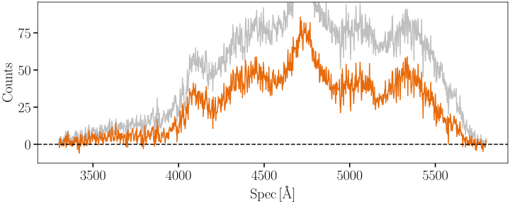

QA
----------------

As a critical step in the HostSub_GP workflow, users should perform quality assurance (QA) checks to ensure the accuracy and reliability of the host galaxy subtraction. HostSub_GP generates a series of QA plots that visualize the results of the data preprocessing, GP modeling, and host subtraction. These plots are saved in the ``QA/`` folder.

Here we provide an overview of the key QA plots with the example of `SN2019eix <https://www.wis-tns.org/object/2019eix>`_, a Type Ia supernova emerged on the bar of a bright galaxy, observed with Keck/LRIS.

Host Galaxy Prior
~~~~~~~~~~~~~~~~~~~~~

Pre-processed 2D Spectra
~~~~~~~~~~~~~~~~~~~~~~~~~

Prior Check
~~~~~~~~~~~~~~~~~

Posterior Check
~~~~~~~~~~~~~~~~~~~~~

Predicted 2D Spectra
~~~~~~~~~~~~~~~~~~~~~~

Extracted 1D Spectra
~~~~~~~~~~~~~~~~~~~~~~
